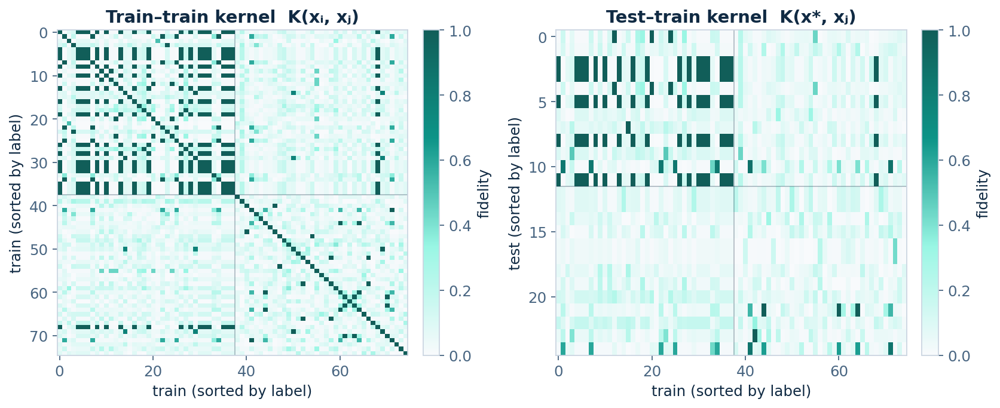
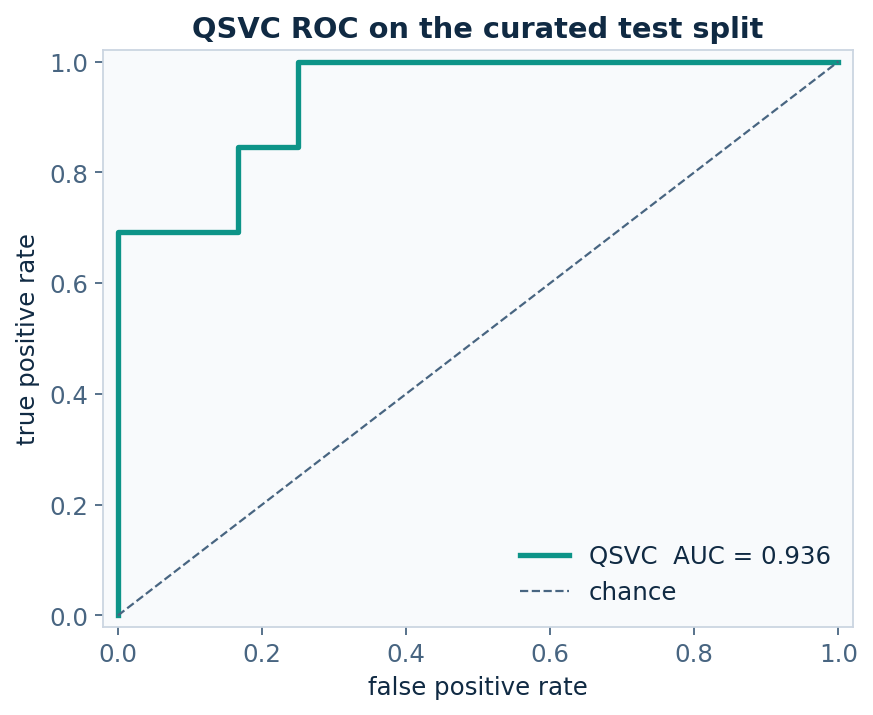
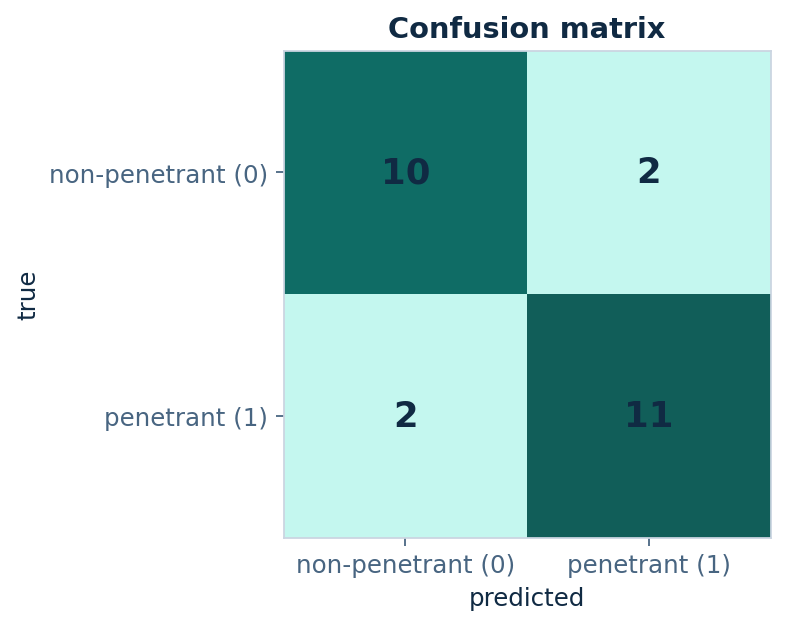
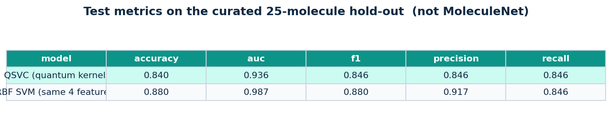

# Quantum_ML

Two complementary **notebook-first** demos on CPU simulators, in one repo:

| Track | Model | Data | Stack |
| --- | --- | --- | --- |
| **Generative** | Quantum Circuit Born Machine (QCBM) | 2×2 Bars-and-Stripes | PennyLane + PyTorch |
| **Predictive** | Quantum kernel SVM (`QSVC`) | curated [BBBP](https://doi.org/10.1039/C7SC02664A) subset | Qiskit + Aer + RDKit |

The generative notebook learns a discrete distribution. The predictive notebook classifies blood–brain barrier labels from compressed Morgan fingerprints. Together they are a small portfolio of *the shape* of molecular generative / QSAR work — not a docking pipeline and **not** a claim of quantum advantage.

<p align="center">
  
</p>

<p align="center">
  
</p>

<p align="center">
  
</p>

<p align="center">
  
  
</p>

<p align="center">
  
</p>

## 1. Generative — QCBM on Bars-and-Stripes

A parameterized 4-qubit circuit. Measuring it in the computational basis defines a generative distribution over 16 bitstrings. Training (PyTorch Adam) pushes that Born distribution onto the six legal BAS patterns. On the committed seed this run reaches **KL ≈ 0** and **P(valid) ≈ 1** in under 160 Adam steps.

See [`notebooks/qcbm_bars_and_stripes.ipynb`](notebooks/qcbm_bars_and_stripes.ipynb).

**Ansatz** — PennyLane `StronglyEntanglingLayers` (4 qubits × 4 layers)  
**Device** — `default.qubit` (exact CPU statevector)  
**Loss** — \(\mathrm{KL}(\pi \,\|\, p_\theta)\) on the full 16-outcome vector

2×2 BAS is the default because \(2^4 = 16\) amplitudes are cheap. 4×4 BAS (16 qubits, 30 valid patterns) is an optional extension noted in that notebook.

## 2. Predictive — quantum kernel on BBBP

Blood–brain barrier penetration is a public binary QSAR task ([Martins et al., 2012](https://doi.org/10.1021/ci300124c); MoleculeNet / DeepChem CSV). The full file has ~2 050 compounds. A 4-qubit kernel cannot see that space, so the notebook uses a **documented, stratified subset of 100 molecules** (50 penetrant / 50 non-penetrant):

1. Drop unparseable SMILES and duplicate structures.
2. Morgan fingerprints (RDKit, radius 2, 2048 bits).
3. Keep molecules a cheap 24-bit logistic model already calls high-confidence.
4. Balanced sample, seed 21; stratified 75 / 25 split.
5. Re-select bits and fit PCA **on train only** → 4 angles in \([0, \pi]\).
6. Encode with a 4-qubit `zz_feature_map`, evaluate \(K(x,y)=|\langle\phi(x)|\phi(y)\rangle|^2\) on **Aer statevector**, classify with Qiskit ML `QSVC`.

On the committed seed the curated hold-out scores about **accuracy 0.84 / AUC 0.94**. A classical RBF SVM on the *same four PCA angles* is reported beside it (usually a bit higher). That is a clean demo on a biased slice — **not** a MoleculeNet scaffold-split result and not evidence that quantum kernels win on full BBBP.

See [`notebooks/qiskit_quantum_kernel_bbbp.ipynb`](notebooks/qiskit_quantum_kernel_bbbp.ipynb). Curation details and every test prediction live in that notebook and in `data/bbbp_curated.csv`.

## How to run

```bash
git clone https://github.com/raptortreats/Quantum_ML.git
cd Quantum_ML
python3 -m venv .venv
source .venv/bin/activate          # Windows: .venv\Scripts\activate
pip install -r requirements.txt
```

Both notebooks are already executed so GitHub renders the plots. Re-run every cell in order, or regenerate figures from the CLI:

```bash
# generative QCBM
jupyter notebook notebooks/qcbm_bars_and_stripes.ipynb
PYTHONPATH=. python -m src.train

# predictive quantum kernel
jupyter notebook notebooks/qiskit_quantum_kernel_bbbp.ipynb
PYTHONPATH=. python -m src.run_bbbp
```

`src.run_bbbp` writes `figures/bbbp_*.png` and refreshes `data/bbbp_curated.csv`. The full MoleculeNet file is cached at `data/BBBP.csv` (DeepChem URL in the notebook if you need to re-download).

## Bridge to drug-discovery / BBB work

Many early design questions are either **generative** over discrete binary objects (fragment occupancy, fingerprint bits) or **predictive** over those same descriptors (penetrant / not, active / not). The two notebooks are pedagogical stand-ins for those jobs.

They are not:

- a claim that QCBMs or QSVC beat VAEs, graph nets, or ECFP baselines on molecules,
- a replacement for docking, FEP, permeability assays, or CNS MPO,
- evidence of near-term quantum advantage.

Four simulated qubits cannot represent a drug-like molecule. Classical chemistry stacks are the practical tools. What transfers is the workflow: define a small, honest representation, train a model, and report validity or accuracy *while stating the subset and the compression*.

## Project layout

```
notebooks/qcbm_bars_and_stripes.ipynb        # generative walkthrough
notebooks/qiskit_quantum_kernel_bbbp.ipynb   # predictive walkthrough
src/bas.py src/qcbm.py src/plots.py src/train.py
src/bbbp_data.py src/qkernel.py src/bbbp_plots.py src/run_bbbp.py
data/BBBP.csv                                # public MoleculeNet dump
data/bbbp_curated.csv                        # 100-molecule demo slice
figures/                                     # committed plots for GitHub
requirements.txt
```

## Scope

Tight on purpose: two datasets, two circuit families, CPU simulators only, two notebooks. No hardware backends, no giant literature dump.

## References

1. Liu, J.-G. & Wang, L. Differentiable learning of quantum circuit Born machines. *Phys. Rev. A* **98**, 062324 (2018).
2. Benedetti, M. *et al.* A generative modeling approach for benchmarking and training shallow quantum circuits. *npj Quantum Inf.* **5**, 45 (2019).
3. [PennyLane QCBM demo](https://pennylane.ai/qml/demos/tutorial_qcbm).
4. Havlíček, V. *et al.* Supervised learning with quantum-enhanced feature spaces. *Nature* **567**, 209–212 (2019).
5. Martins, I. F. *et al.* A Bayesian approach to *in silico* blood-brain barrier penetration modeling. *J. Chem. Inf. Model.* **52**, 1686–1697 (2012).
6. Wu, Z. *et al.* MoleculeNet: a benchmark for molecular machine learning. *Chem. Sci.* **9**, 513–530 (2018).
7. [Qiskit Machine Learning — QSVC](https://qiskit-community.github.io/qiskit-machine-learning/stubs/qiskit_machine_learning.algorithms.QSVC.html).
