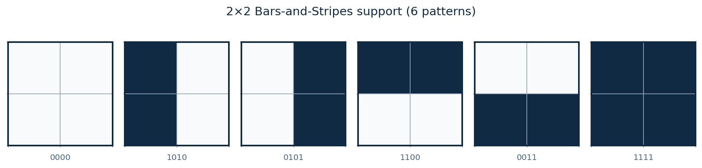
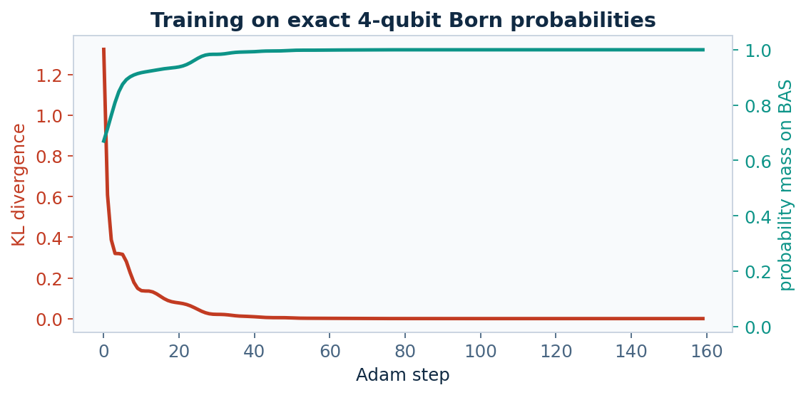
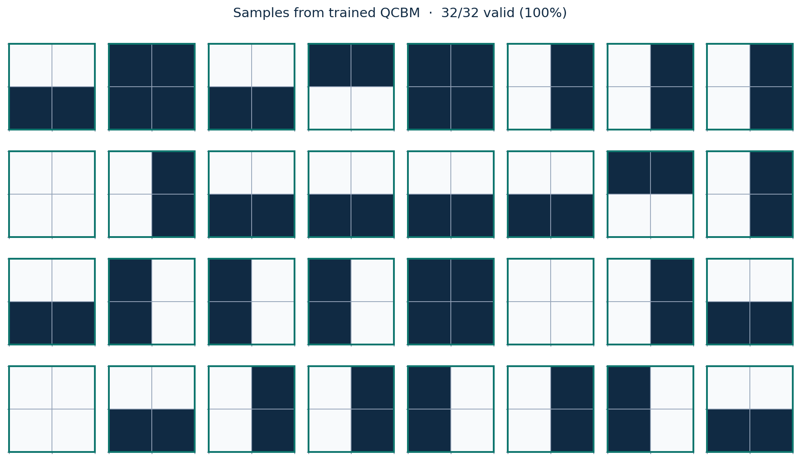

# Quantum Circuit Born Machine

A notebook-first portfolio project: train a **Quantum Circuit Born Machine (QCBM)** to learn the 2×2 **Bars-and-Stripes** distribution on a PennyLane CPU simulator.

The model is a parameterized 4-qubit circuit. Measuring it in the computational basis defines a generative distribution over 16 bitstrings. Training (PyTorch Adam) pushes that Born distribution onto the six legal BAS patterns.

<p align="center">
  
</p>

<p align="center">
  
</p>

<p align="center">
  
</p>

## Problem

Generative models learn a distribution \(P(x)\) from which new samples can be drawn. Here each \(x\) is a small binary image. The task is deliberately tiny: recover a known discrete support well enough that most shots land on a valid bar or stripe, and the learned probabilities match the uniform target.

That is the same *shape* of problem as learning a distribution over molecular fingerprints or other on/off descriptors — without pretending that four qubits replace a chemistry stack.

## Method

A QCBM prepares a pure state \(|\psi_\theta\rangle\) and uses the Born rule

\[
p_\theta(x) = \lvert\langle x\mid\psi_\theta\rangle\rvert^2
\]

as the generative model ([Liu & Wang, 2018](https://doi.org/10.1103/PhysRevA.98.062324); [Benedetti et al., 2019](https://doi.org/10.1038/s41534-019-0157-8)).

This repo uses:

- **Ansatz** — PennyLane `StronglyEntanglingLayers` (single-qubit rotations + ring CNOTs) on 4 qubits, 4 layers
- **Device** — `default.qubit` (exact CPU statevector; no hardware backend)
- **Loss** — \(\mathrm{KL}(\pi \,\|\, p_\theta)\) on the full 16-outcome probability vector
- **Optimizer** — `torch.optim.Adam`

2×2 BAS is the default because \(2^4 = 16\) amplitudes are cheap and training is reliable. 4×4 BAS (16 qubits, 30 valid patterns) is an optional extension; at that width you typically switch from exact KL to a sample-based loss such as MMD.

## How to run

One path, top to bottom:

```bash
git clone https://github.com/raptortreats/Quantum_ML.git
cd Quantum_ML
python3 -m venv .venv
source .venv/bin/activate          # Windows: .venv\Scripts\activate
pip install -r requirements.txt
jupyter notebook notebooks/qcbm_bars_and_stripes.ipynb
```

Run every cell in order. The notebook writes the same figures under `figures/`.

Optional, without Jupyter:

```bash
source .venv/bin/activate
PYTHONPATH=. python -m src.train
```

## Bridge to drug-discovery / molecular binary distributions

Many early design problems are generative models over **discrete binary objects**: fragment occupancy, hashed fingerprint bits, or other on/off descriptors. A trained QCBM is a compact way to study that mathematical job — fit \(P(x)\) on a known support, then measure how much probability lands on “valid” strings.

This is a pedagogical analogy, not a docking pipeline and **not a claim of quantum advantage**. Classical generative models (VAEs, flows, diffusion) are the practical tools for chemistry today. Four simulated qubits cannot represent a drug-like molecule. What transfers is the workflow: define a binary support, train a generative model, and score validity and distribution match.

## Project layout

```
notebooks/qcbm_bars_and_stripes.ipynb   # primary walkthrough
src/bas.py                              # Bars-and-Stripes support
src/qcbm.py                             # circuit, KL training, metrics
src/plots.py                            # README / notebook figures
src/train.py                            # optional CLI to regenerate figures
figures/                                # committed plots for GitHub
requirements.txt
```

## Scope

Tight on purpose: one dataset, one circuit family, one CPU simulator, one notebook. No hardware backends, no giant literature dump.

## References

1. Liu, J.-G. & Wang, L. Differentiable learning of quantum circuit Born machines. *Phys. Rev. A* **98**, 062324 (2018).
2. Benedetti, M. *et al.* A generative modeling approach for benchmarking and training shallow quantum circuits. *npj Quantum Inf.* **5**, 45 (2019).
3. [PennyLane QCBM demo](https://pennylane.ai/qml/demos/tutorial_qcbm) (MMD training on larger BAS).
